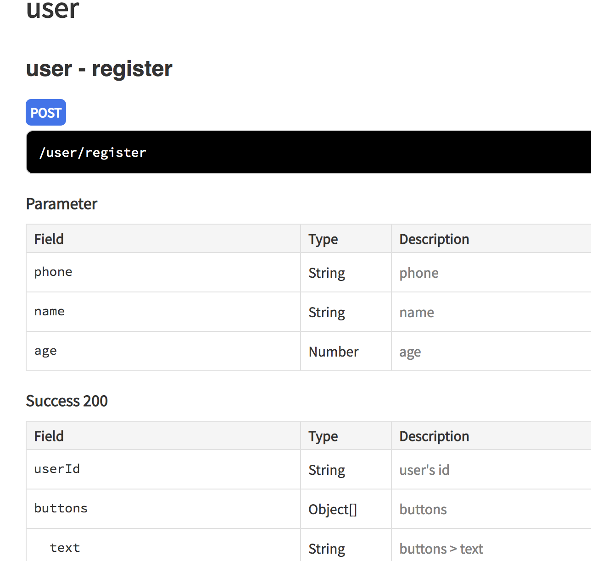

# apidoc-plugin-class-validator
An [apidoc](http://apidocjs.com/) plugin for [class validator](https://github.com/typestack/class-validator)

## Install
```
npm i apidoc-plugin-class-validator
```

## Usage

- Register.ts
```
import {Length, Min, Max} from 'class-validator'

export class IRegister {
  @Length(13)
  phone: string

  @Length(2, 10)
  name: string

  @Min(18)
  @Max(50)
  age: number
}

class Button {
  text: string
}

export class ORegister {
  /**
   * user's id
   */
  userId: string

  buttons: Button[]
}
```

- Anywhere
```
/**
 * @api {post} /user/register register
 * @apiGroup user
 * @apiName register
 * @apiParamClass (test/src/user/io/Register.ts) {IRegister}
 * @apiSuccessClass (test/src/user/io/Register.ts) {ORegister}
 */
export function register () {
  // empty
}
```
- Generate docs
```
./node_modules/.bin/apidoc -i test/src/ -o docs
```

- Open the docs

